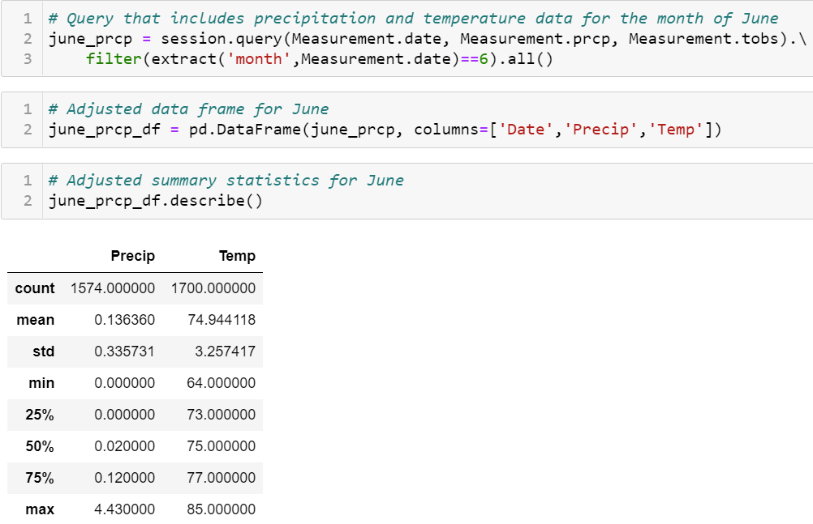

# Surfs Up with SQLAlchemy

## Project Overview
The following project involves using SQLAlchemy in conjunction with an SQLite database to determine the viability of a Surf n' Shake shop in Oahu, Hawaii. A surf shop with a similar concept had previously flopped due to the weather conditions. To avoid the same fate, we must determine whether the weather conditions are optimal for the venture to succeed. By querying an SQLite database containing weather data with the power of python and its dependencies, we will analyze the weather patterns of Oahu to decide if the conditions are sustainable for our business venture. 
## Resources
- Python 3.7.6 
- Jupyter Notebook
- SQLite
- SQLAlchemy

## Results

    

- The average temperature is lower in December, and the data points for that month are more spread out
- The minimum temperature in December is almost 10 degrees lower
- The total count of temperature observations in December is lower by approximately 200
## Summary
The summary statistics for June and December aren't drastically different. If we took a quick glance over the tables, we probably wouldn't notice a difference! The temperature appears to be in the 70s year-round, considering half the data points for each month we analyzed are above 70 degrees. The lowest quartile for December is 69 degrees, which means only 25 percent of the data recorded in December dips below the 70s. A quick google search shows that the winter months for Hawaii are from November to April, and the summer months are from May to October. If we consider these results in our analysis, it appears that Oahu should have a consistent temperature throughout the year with only a few dates below the 70s. 

However, we should also take precipitation into account. If we add precipitation into our original queries, the average rainfall for December is considerably higher than June. The average rain appears to be skewed, considering that December's median rainfall is much lower than the mean. Furthermore, the median and upper quartile for June are similar to December's. Overall, the weather is consistent in Oahu. The perfect location for Surf n' Shake if we are only considering weather conditions. 

    

